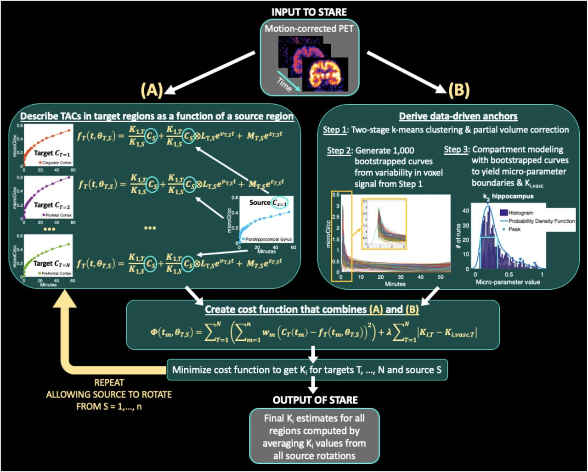

.. py_stare_pet documentation master file, created by
   sphinx-quickstart on Tue Dec  7 22:27:58 2021.
   You can adapt this file completely to your liking, but it should at least
   contain the root `toctree` directive.

STARE
=====

Source-to-Target Automated Rotating Estimation (STARE)
is described in `Bartlett, et al. 2022 <https://doi.org/10.1016/j.neuroimage.2022.118901>`_.

Running with Docker
-------------------

The easiest way to run stare is to pull the docker container and run it.
This is recommended because stare has several dependencies that are
installed into the docker container, but would need to be installed
separately to run stare in a local python virtualenv.

.. code-block:: bash
  :caption: executing stare with docker

  docker pull mfschmidt/stare:latest
  docker run -it --user $(id -u):$(id -g) --rm \
    -v /path/to/rawdata:/in:ro \
    -v /path/to/derivatives:/out \
    mfschmidt/stare:latest SUBJECT_ID \
    -i /in -o /out \
    --ignore-frames 8 --axial-slices-to-clip 6 --verbose

The `--user` option
tells docker to build directories and write files as the user invoking the
command (by default, docker containers write files as root), making the
output files easier to edit/move/delete if desired.

The options above assume you have PET data in `/path/to/rawdata/SUBJECT_ID/`
and would like to save the results to
`/path/to/derivatives/SUBJECT_ID/`. Additional options will cause stare
to ignore the 8th frame and clip off
the 6 inferior-most slices of each volume before doing vascular clustering.
Stare always writes verbose output to a log file, but using `--verbose`
increases the information sent to stdout. If you use `--verbose --verbose`,
it will also write out masks for every cluster, even those deemed irrelevant,
into a `debug` directory so you can look more closely at them.
These and additional command-line options are documented in
`the stare executable <stare.html>`_.

The expected layout and file naming of input directories is still undocumented,
making this software only useful for the developers at this point.

Documentation
-------------

.. toctree::
   :maxdepth: 3
   :caption: Contents:

   stare
   starelib
   classes

Changelog
---------

   changelog
